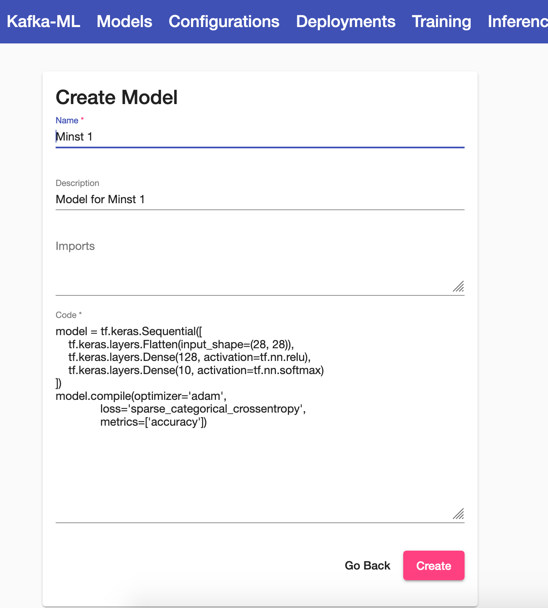
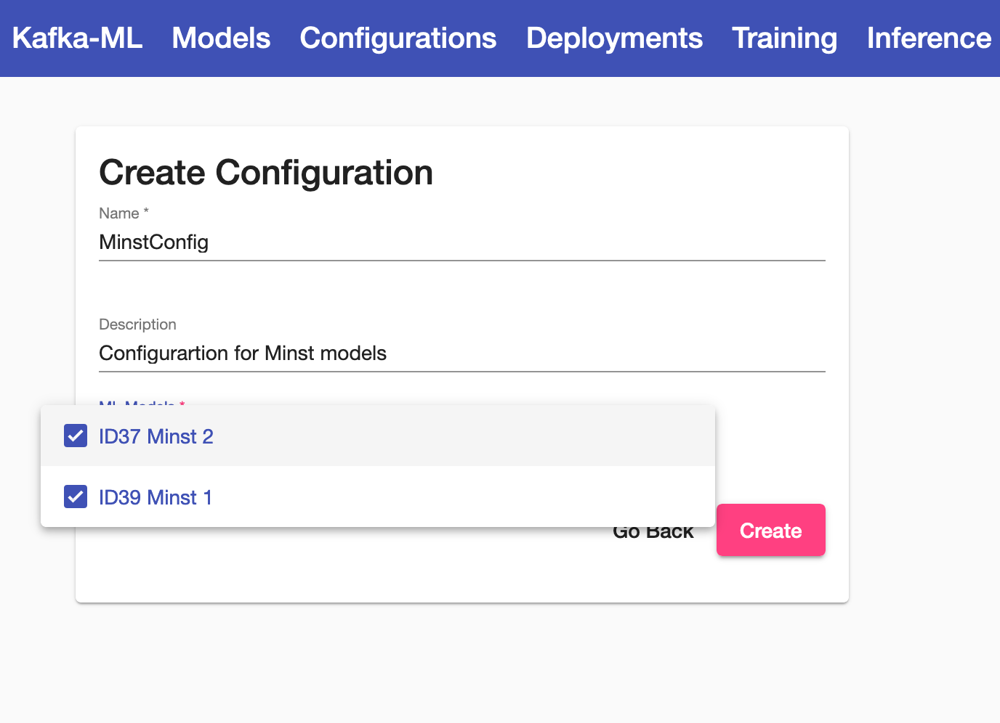
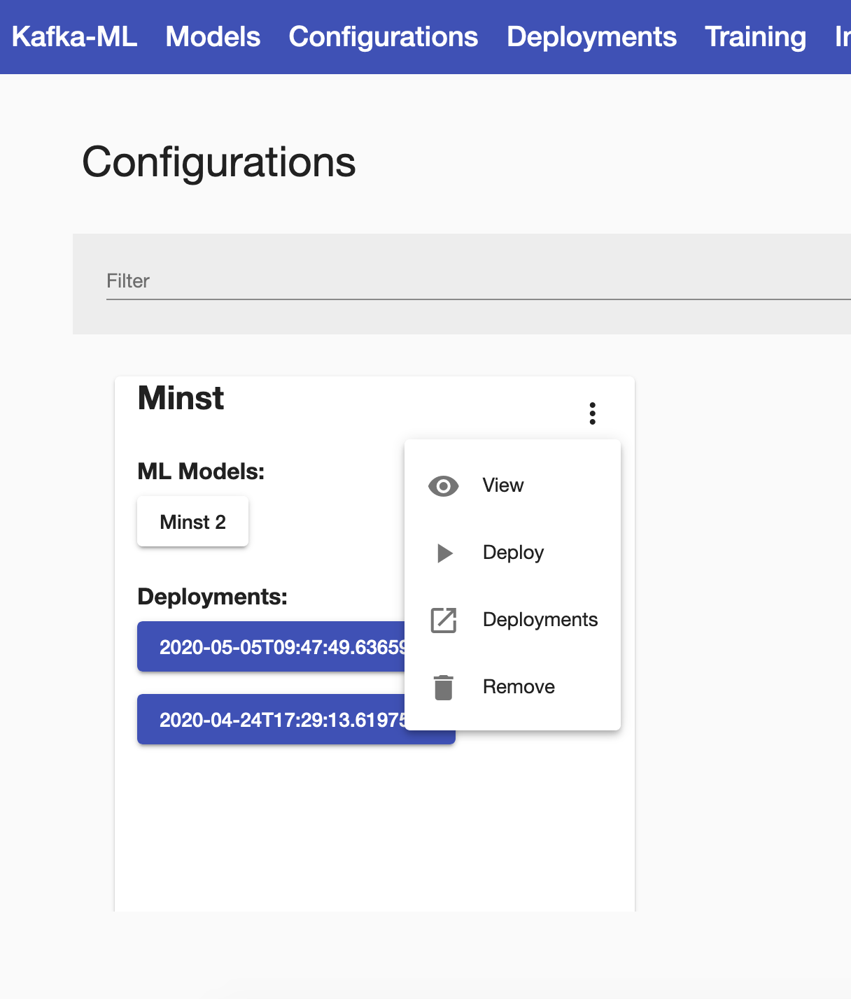
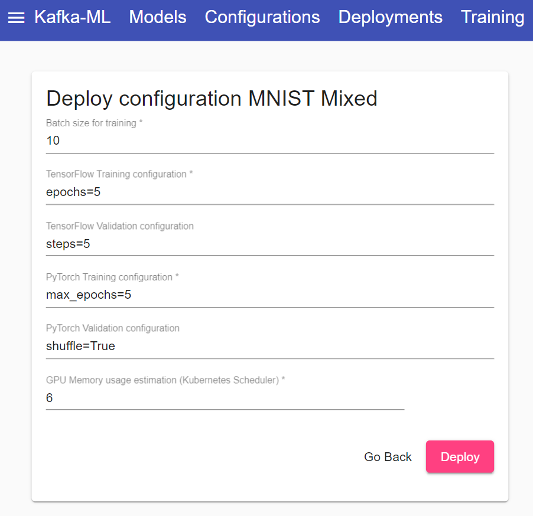
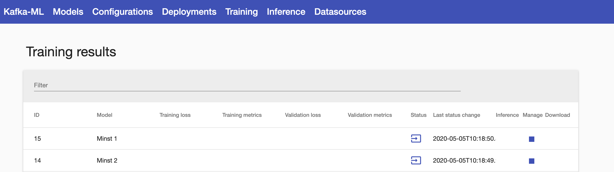
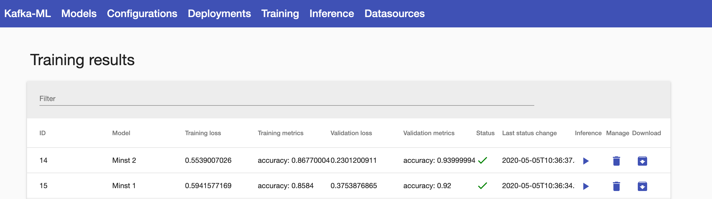
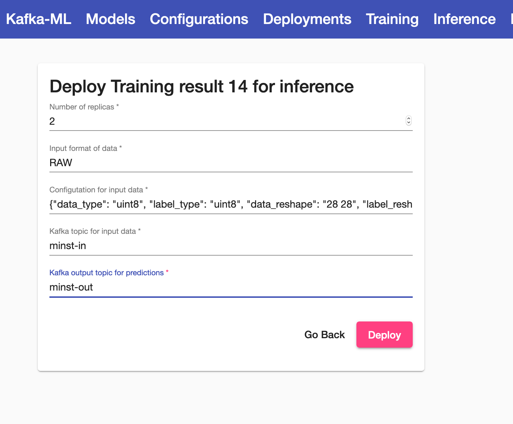

# Kafka-ML: connecting the data stream with ML/AI frameworks

Kafka-ML is a framework to manage the pipeline of Tensorflow/Keras machine learning (ML) models on Kubernetes. The pipeline allows the design, training, and inference of ML models. The training and inference datasets for the ML models can be fed through Apache Kafka, thus they can be directly connected to data streams like the ones provided by the IoT.  

ML models can be easily defined in the Web UI with no need for external libraries and executions, providing an accessible tool for both experts and non-experts on ML/AI.

## Table of Contents
- [Usage](#usage)
- [Installation and development](#Installation-and-development)
    - [Requirements](#requirements) 
    - [Steps to build and execute Kafka-ML](#Steps-to-build-and-execute-Kafka-ML)
- [License](#license)

## Usage
To follow this tutorial, please deploy Kafka-ML as indicated below in [Installation and development](#Installation-and-development).

Create a model with just a TF/Keras model source code and some imports/functions if needed. Maybe this model for the MINST dataset is a simple way to start:

```
model = tf.keras.Sequential([
    tf.keras.layers.Flatten(input_shape=(28, 28)),
    tf.keras.layers.Dense(128, activation=tf.nn.relu),
    tf.keras.layers.Dense(10, activation=tf.nn.softmax)
])
model.compile(optimizer='adam',
              loss='sparse_categorical_crossentropy',
              metrics=['accuracy'])
````

Insert the ML code into the Kafka-ML UI.



Create a configuration. A configuration is a set of models that can be grouped for training. This can be useful when you want to evaluate and compare the metrics (e.g, loss and accuracy) of a set of models or just to define a group of them that can be trained with the same data stream in parallel. A configuration can also contain a single ML model.



Deploy a configuration of models in Kubernetes for training 



Change the batch size, training and validation parameters in the Deployment form. Use the same format and parameters than TensorFlow methods *fit* and *evaluate* respectively. Validation parameters are optional (they are only used if *validation_rate>0* in the stream data received).



Once the configuration is deployed, you will see one training result per model in the configuration. Models are now ready to be trained and receive stream data.



Now, it is time to ingest the model(s) with your data stream for training and maybe evaluation

If you have used the MINST model you can use the example `mnist_dataset_training_example.py`. You only need to configure the *deployment_id* attribute to the one generated in Kafka-ML, maybe it is still 1. This is the way to match data streams with configurations and models during training. You may need to install the Python libraries listed in datasources/requirements.txt.

If so, please execute the MISNT example for training:

````
python examples/MINST_RAW_format/mnist_dataset_training_example.py
````

You can use your own example using the AvroSink (for Apache Avro types) and RawSink (for simple types) sink libraries to send training and evaluation data to Kafka. Remember, you always have to configure the *deployment_id* attribute to the one generated in Kafka-ML. 

Once sent the data stream, and deployed and trained the models, you will see the models metrics and results in Kafka-ML. You can download now the trained models, or just continue the ML pipeline to deploy a model for inference.



When deploying a model for inference, the parameters for the input data stream will be automatically configured based on previous data streams received, you might also change this. Mostly you will have to configure the number of replicas you want to deploy for inference and the Kafka topics for input data (values to predict) and output data (predictions).



Finally, test the inference deployed using the MNIST example for inference in the topics deployed:

````
python examples/MINST_RAW_format/mnist_dataset_inference_example.py
````

## Installation and development

### Requirements

- [Python supported by Tensorflow 3.5–3.7](https://www.python.org/)
- [Node.js](https://nodejs.org/)
- [Docker](https://www.docker.com/)
- [kubernetes>=v1.15.5](https://kubernetes.io/)

### Steps to build and execute Kafka-ML

1. You may need to deploy a local register to upload your Docker images. You can deploy it in the port 5000:
    ```
    docker run -d -p 5000:5000 --restart=always --name registry registry:2
    ```

2. Build the backend and push the image into the local register:
    ```
    cd backend
    docker build --tag localhost:5000/backend .
    docker push localhost:5000/backend 
    ```

3. Build the model_training component and push the image into the local register:
    ```
    cd model_training
    docker build --tag localhost:5000/model_training .
    docker push localhost:5000/model_training 
    ```

4. Build the kafka_control_logger component and push the image into the local register:
    ```
    cd kafka_control_logger
    docker build --tag localhost:5000/kafka_control_logger .
    docker push localhost:5000/kafka_control_logger 
    ```

5. Build the model_inference component and push the image into the local register:
    ```
    cd model_inference
    docker build --tag localhost:5000/model_inference .
    docker push localhost:5000/model_inference 
    ```

6. Install the libraries and execute the frontend:
    ```
    cd frontend
    npm install
    ng build -c production
    docker build --tag localhost:5000/frontend .
    docker push localhost:5000/frontend 
    ```

7. Once built the images, you can deploy the system components in Kubernetes following this order:
    ```
    kubectl apply -f zookeeper-pod.yaml
    kubectl apply -f zookeeper-service.yaml
    
    kubectl apply -f kafka-pod.yaml
    kubectl apply -f kafka-service.yaml
    
    kubectl apply -f backend-deployment.yaml
    kubectl apply -f backend-service.yaml

    kubectl apply -f frontend-deployment.yaml
    kubectl apply -f frontend-service.yaml

    kubectl apply -f kafka-control-logger-deployment.yaml
    ```

8. Finally, you will be able to access the Kafka-ML Web UI: http://localhost/

## License
MIT
