# Kafka-ML: connecting the data stream with ML/AI frameworks

Kafka-ML is a framework to manage the pipeline of Tensorflow/Keras and PyTorch (Ignite) machine learning (ML) models on Kubernetes. The pipeline allows the design, training, and inference of ML models. The training and inference datasets for the ML models can be fed through Apache Kafka, thus they can be directly connected to data streams like the ones provided by the IoT.  

ML models can be easily defined in the Web UI with no need for external libraries and executions, providing an accessible tool for both experts and non-experts on ML/AI.

<p align="center">
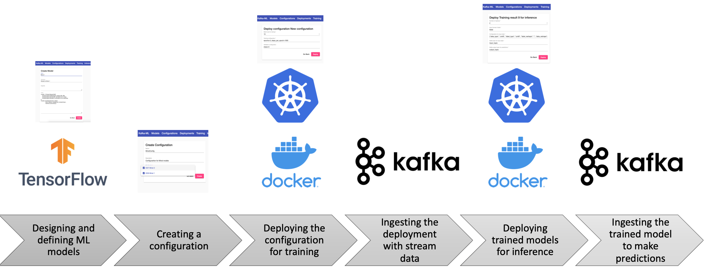
</p>

You can find more information about Kafka-ML and its architecture in the open-access publication below:
> _C. Martín, P. Langendoerfer, P. Zarrin, M. Díaz and B. Rubio <br>
> **Kafka-ML: connecting the data stream with ML/AI frameworks** <br>
> Future Generation Computer Systems, 2022, vol. 126, p. 15-33 <br> 
> [10.1016/j.future.2021.07.037](https://www.sciencedirect.com/science/article/pii/S0167739X21002995)_

If you wish to reuse Kafka-ML, please properly cite the above mentioned paper. Below you can find a BibTex reference:
```
@article{martin2022kafka,
  title={Kafka-ML: connecting the data stream with ML/AI frameworks},
  author={Mart{\'\i}n, Cristian and Langendoerfer, Peter and Zarrin, Pouya Soltani and D{\'\i}az, Manuel and Rubio, Bartolom{\'e}},
  journal={Future Generation Computer Systems},
  volume={126},
  pages={15--33},
  year={2022},
  publisher={Elsevier}
}
```
Kafka-ML article has been selected as [Spring 2022 Editor’s Choice Paper at Future Generation Computer Systems](https://www.sciencedirect.com/journal/future-generation-computer-systems/about/editors-choice)! :blush: :book: :rocket:

## Table of Contents
- [Changelog](#changelog)
- [Usage](#usage)
    - [Single models](#Single-models)
    - [Distributed models](#Distributed-models)
- [Installation and development](#Installation-and-development)
    - [Requirements](#requirements) 
    - [GPU configuration](#GPU-configuration)
    - [Steps to build Kafka-ML](#Steps-to-build-Kafka-ML)
- [Publications](#publications)
- [License](#license)

## Changelog
- [29/04/2021] Integration of distributed models.
- [05/11/2021] Automation of data types and reshapes for the training module.
- [20/01/2022] Added GPU support. ML Code has been taken out of backend.
- [04/03/2022] Added PyTorch ML Framework support!
- [08/04/2022] Added support for learning curves visualization, confusion matrix generation and small changes on metrics visualization. Now datasets can be splitted into training, validation and test.
- [26/05/2022] Included support for visualization of prediction data. Now you can easily prototype and visualize your ML/AI application. You can train models, deploy them for inference, and visualize your prediction data just with data streams.
## Usage
To follow this tutorial, please deploy Kafka-ML as indicated below in [Installation and development](#Installation-and-development).

### Single models

Create a model with just a TF/Keras model source code and some imports/functions if needed. Maybe this model for the MINST dataset is a simple way to start:

```py
model = tf.keras.models.Sequential([
  tf.keras.layers.Flatten(input_shape=(28, 28)),
  tf.keras.layers.Dense(128, activation='relu'),
  tf.keras.layers.Dense(10, activation='softmax')
])
model.compile(
    optimizer=tf.keras.optimizers.Adam(0.001),
    loss=tf.keras.losses.SparseCategoricalCrossentropy(from_logits=True),
    metrics=[tf.keras.metrics.SparseCategoricalAccuracy()],
)
````

Something similar should be done in case you wish to use PyTorch:
```py
class NeuralNetwork(nn.Module):
    def __init__(self):
        super(NeuralNetwork, self).__init__()
        self.flatten = nn.Flatten()
        self.linear_relu_stack = nn.Sequential(
            nn.Linear(28*28, 128),
            nn.ReLU(),
            nn.Linear(128, 10),
            nn.Softmax()
        )

    def forward(self, x):
        x = self.flatten(x)
        logits = self.linear_relu_stack(x)
        return logits

    def loss_fn(self):
        return nn.CrossEntropyLoss()

    def optimizer(self):
        return torch.optim.Adam(model.parameters(), lr=0.001)

    def metrics(self):
        val_metrics = {
            "accuracy": Accuracy(),
            "loss": Loss(self.loss_fn())
         }
        return val_metrics

model = NeuralNetwork()
```

Note that functions 'loss_fn', 'optimizer', and 'metrics' must necessarily be defined.

Insert the ML code into the Kafka-ML UI.

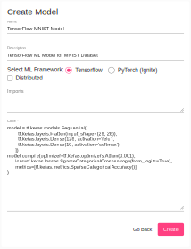

<br/>

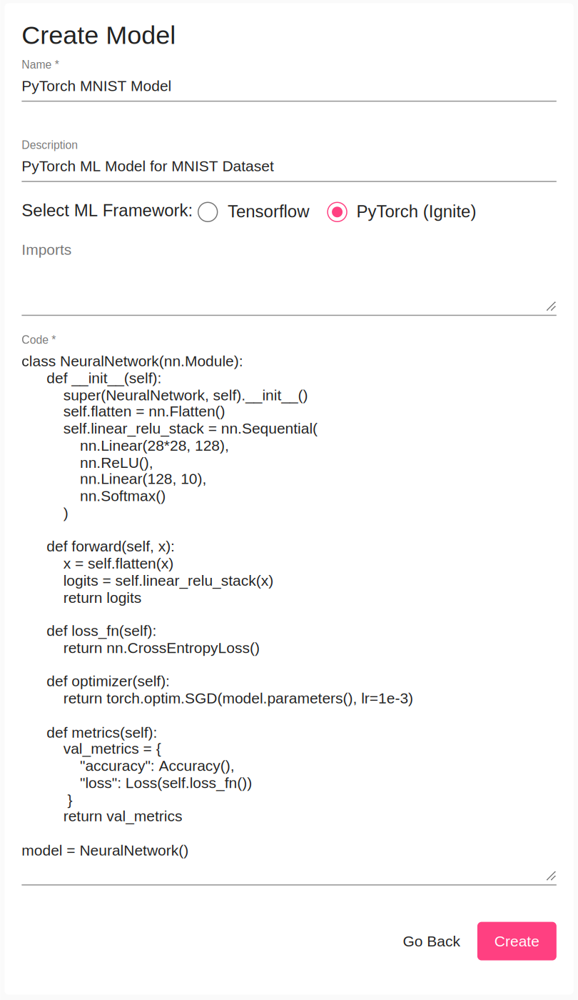

Create a configuration. A configuration is a set of models that can be grouped for training. This can be useful when you want to evaluate and compare the metrics (e.g, loss and accuracy) of a set of models or just to define a group of them that can be trained with the same data stream in parallel. A configuration can also contain a single ML model.

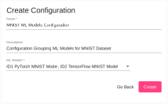

Deploy a configuration of models in Kubernetes for training.


Change the batch size, training and validation parameters in the Deployment form. Use the same format and parameters than TensorFlow methods *fit* and *evaluate* respectively. Validation parameters are optional (they are only used if *validation_rate>0 or test_rate>0* in the stream data received).

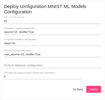

Once the configuration is deployed, you will see one training result per model in the configuration. Models are now ready to be trained and receive stream data.


Now, it is time to ingest the model(s) with your data stream for training and maybe evaluation.

If you have used the MINST model you can use the example `mnist_dataset_training_example.py`. You only need to configure the *deployment_id* attribute to the one generated in Kafka-ML, maybe it is still 1. This is the way to match data streams with configurations and models during training. You may need to install the Python libraries listed in datasources/requirements.txt.

If so, please execute the MISNT example for training:

````
python examples/MINST_RAW_format/mnist_dataset_training_example.py
````

You can use your own example using the AvroSink (for Apache Avro types) and RawSink (for simple types) sink libraries to send training and evaluation data to Kafka. Remember, you always have to configure the *deployment_id* attribute to the one generated in Kafka-ML. 

Once sent the data stream, and deployed and trained the models, you will see the models metrics and results in Kafka-ML. You can download now the trained models, or just continue the ML pipeline to deploy a model for inference.

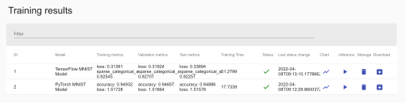

If you wish to visualise the generated confusion matrix (in case it has been indicated) or to visualise some training and validation metrics (if any) per epoch, you can access for each training result to the following view. 

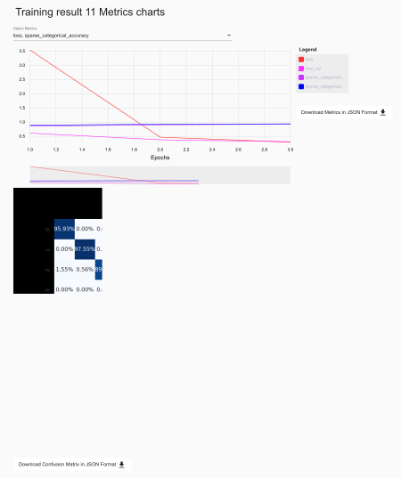

In addition, from this view you can access to this data in a more generic way in JSON, allowing you to generate new plots and other information for your reports.

When deploying a model for inference, the parameters for the input data stream will be automatically configured based on previous data streams received, you might also change this. Mostly you will have to configure the number of replicas you want to deploy for inference and the Kafka topics for input data (values to predict) and output data (predictions).

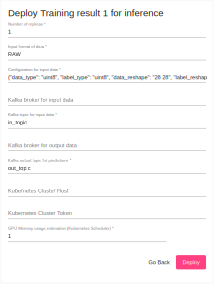

Finally, test the inference deployed using the MNIST example for inference in the topics deployed:

````
python examples/MINST_RAW_format/mnist_dataset_inference_example.py
````
In the visualization tab, you can easily visualize your deployed models. First thing, you need to configure how your model prediction data will be visualized. Here is the example for the MINST dataset:

```json
{
    "average_updated": false,
    "average_window": 10000,
    "type": "classification",
    "labels":[     
    {
          "id": 0,
          "color": "#fff100",
          "label": "Zero"
        },
        {
          "id": 1,
          "color": "#ff8c00",
          "label": "One"
        },
        {
          "id": 2,
          "color": "#e81123",
          "label": "Two"
        },
        {
          "id": 3,
          "color": "#ec008c",
          "label": "Three"
        },
        {
          "id": 4,
          "color": "#68217a",
          "label": "Four"
        },
        {
          "id": 5,
          "color": "#00188f",
          "label": "Five"
        },
        {
          "id": 6,
          "color": "#00bcf2",
          "label": "Six"
        },
        {
          "id": 7,
          "color": "#00b294",
          "label": "Seven"
        },
        {
          "id": 8,
          "color": "#009e49",
          "label": "Eight"
        },
        {
          "id": 9,
          "color": "#bad80a",
          "label": "Nine"
        }
      ]
}
````
You can specify the two types of visualization: 'regression' and 'classification'. In classification mode, 'average_update' determines if you want to have the current status displayed based on the higher average status, and 'average_window' determines the windows for calculating the average.  

For each output of your model, you have to define a label. 'id' represents the position of the param in the model output (e.g., suppose you have a temperature output as the second parameter of your model), and with 'color' and 'label' you can set a color and label to display for the param.

Once you set the configuration, you must also set the output topic where the model is deployed, 'minst-out' in our last example. After this, visualization displays your data. 

Here is an example in classification mode:

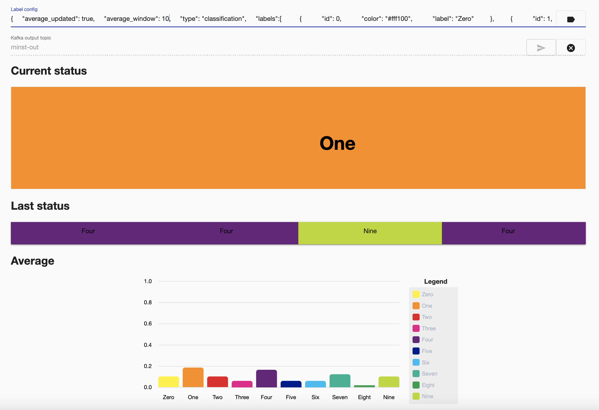

And in regression mode:

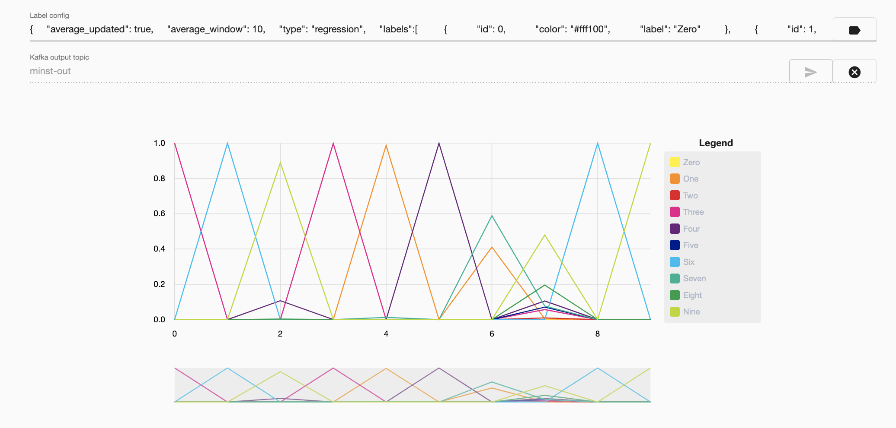

### Distributed models

Create a distributed model with just a TF/Keras model source code and some imports/functions if needed. Maybe this distributed model consisting of three sub-models for the MINST dataset is a simple way to start:

```py
edge_input = keras.Input(shape=(28,28,1), name='input_img')
x = layers.Conv2D(28, kernel_size=(3,3), name='conv2d')(edge_input)
x = layers.MaxPooling2D(pool_size=(2,2), name='maxpooling')(x)
x = layers.Flatten(name='flatten')(x)
output_to_fog = layers.Dense(64, activation=tf.nn.relu, name='output_to_fog')(x)
edge_output = layers.Dense(10, activation=tf.nn.softmax, name='edge_output')(output_to_fog)
edge_model = keras.Model(inputs=[edge_input], outputs=[output_to_fog, edge_output], name='edge_model')

fog_input = keras.Input(shape=64, name='fog_input')
output_to_cloud = layers.Dense(64, activation=tf.nn.relu, name='output_to_cloud')(fog_input)
fog_output = layers.Dense(10, activation=tf.nn.softmax, name='fog_output')(output_to_cloud)
fog_model = keras.Model(inputs=[fog_input], outputs=[output_to_cloud, fog_output], name='fog_model')

cloud_input = keras.Input(shape=64, name='cloud_input')
x = layers.Dense(64, activation=tf.nn.relu, name='relu1')(cloud_input)
x = layers.Dense(128, activation=tf.nn.relu, name='relu2')(x)
x = layers.Dropout(0.2)(x)
cloud_output = layers.Dense(10, activation=tf.nn.softmax, name='cloud_output')(x)
cloud_model = keras.Model(inputs=cloud_input, outputs=[cloud_output], name='cloud_model')
````

Insert the ML code of each sub-model into the Kafka-ML UI separately. You will have to specify the hierarchical relationships between the sub-models through the "Upper model" field of the form (before you will have to check the distributed box). In the example case proposed it has to be defined the following relationships: the upper model of the Edge sub-model is the Fog and the upper model of the Fog sub-model is the Cloud (Cloud sub-model is placed at the top of the distributed chain so it does not have any upper model).

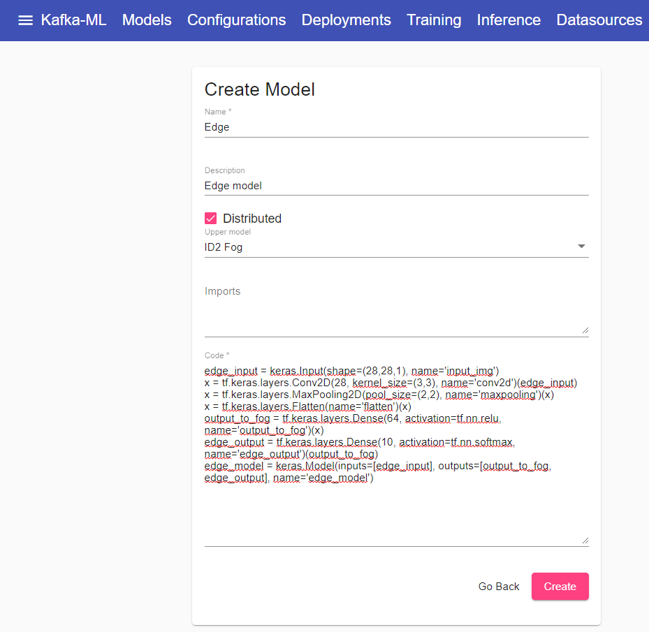

Create a configuration. Kafka-ML will only show those sub-models which are on the top of the distributed chain. Choosing one of them will add its corresponding full distributed model to the configuration.

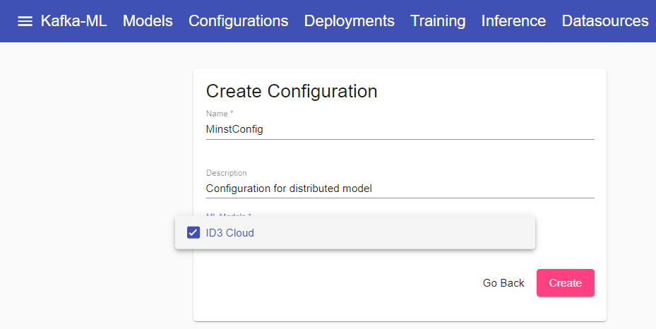

Deploy the configuration of distributed sub-models in Kubernetes for training.

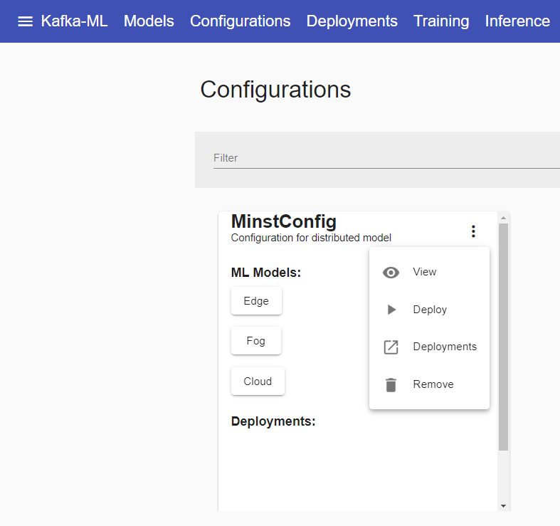

Change the batch size, training and validation parameters in the Deployment form. Use the same format and parameters than TensorFlow methods *fit* and *evaluate* respectively. Validation parameters are optional (they are only used if *validation_rate>0 or test_rate>0* in the stream data received).

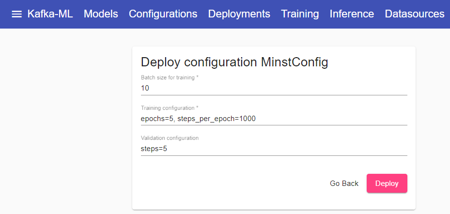

Once the configuration is deployed, you will see one training result per sub-model in the configuration. Full distributed model is now ready to be trained and receive stream data.

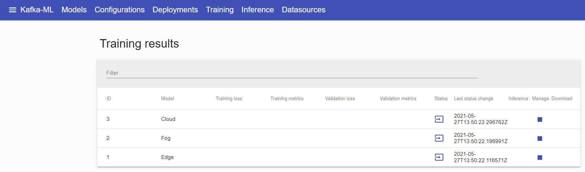

Now, it is time to ingest the distributed model with your data stream for training and maybe evaluation.

If you have used the MINST distributed model you can use the example `mnist_dataset_training_example.py`. You only need to configure the *deployment_id* attribute to the one generated in Kafka-ML, maybe it is still 1. This is the way to match data streams with configurations and models during training. You may need to install the Python libraries listed in datasources/requirements.txt.

If so, please execute the MISNT example for training:

````
python examples/MINST_RAW_format/mnist_dataset_training_example.py
````

Once sent the data stream, and deployed and trained the full distributed model, you will see the sub-models metrics and results in Kafka-ML. You can download now the trained sub-models, or just continue the ML pipeline to deploy a model for inference.

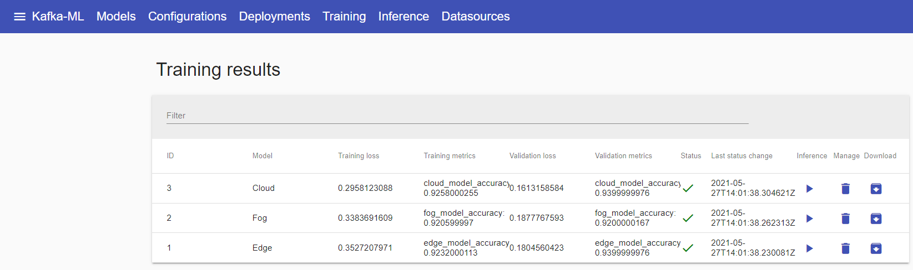

When deploying a sub-model for inference, the parameters for the input data stream will be automatically configured based on previous data streams received, you might also change this. Mostly you will have to configure the number of replicas you want to deploy for inference and the Kafka topics for input data (values to predict) and output data (predictions). Lastly, in case you are deploying a sub-model for inference which is not the last one in the distributed chain, you will also have to specify one more topic for upper data (partial predictions) and a limit number (between 0 and 1). These two fields work as follows: on the one hand, if your deployed inference gets lower predictions values than the limit it will send partial predictions to its upper model using the upper data topic in order to continue the data processing there; on the other hand, if your deployed inference gets higher predictions values than the limit it will send these final results to the output topic.

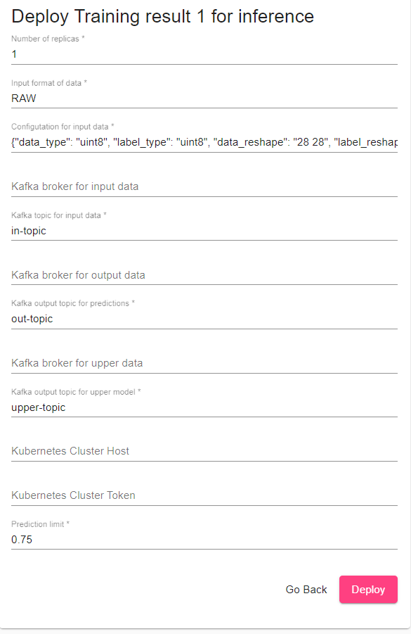

Finally, test the inference deployed using the MNIST example for inference in the topics deployed:

````
python examples/MINST_RAW_format/mnist_dataset_inference_example.py
````

## Installation and development

### Requirements

- [Python supported by Tensorflow 3.5–3.7 and PyTorch 1.10](https://www.python.org/)
- [Node.js](https://nodejs.org/)
- [Docker](https://www.docker.com/)
- [kubernetes>=v1.15.5](https://kubernetes.io/)

### GPU configuration

The following steps are required in order to use GPU acceleration in Kafka-ML and Kubernetes. These steps are required to be performed in all the Kubernetes nodes.

1. GPU Driver installation
```bash
# SSH into the worker machine with GPU
$ ssh USERNAME@EXTERNAL_IP

# Verify ubuntu driver 
$ sudo apt install ubuntu-drivers-common
$ ubuntu-drivers devices

# Install the recommended driver
$ sudo ubuntu-drivers autoinstall

# Reboot the machine 
$ sudo reboot

# After the reboot, test if the driver is installed correctly
$ nvidia-smi
```

2. Nvidia Docker installation
```bash
# SSH into the worker machine with GPU
$ ssh USERNAME@EXTERNAL_IP

# Add the package repositories
$ distribution=$(. /etc/os-release;echo $ID$VERSION_ID)
$ curl -s -L https://nvidia.github.io/nvidia-docker/gpgkey | sudo apt-key add -
$ curl -s -L https://nvidia.github.io/nvidia-docker/$distribution/nvidia-docker.list | sudo tee /etc/apt/sources.list.d/nvidia-docker.list

$ sudo apt-get update && sudo apt-get install -y nvidia-docker2
$ sudo systemctl restart docker
```

3. Modify the following file
```bash
# SSH into the worker machine with GPU
$ ssh USERNAME@EXTERNAL_IP
$ sudo tee /etc/docker/daemon.json <<EOF
{
    "default-runtime": "nvidia",
    "runtimes": {
        "nvidia": {
            "path": "/usr/bin/nvidia-container-runtime",
            "runtimeArgs": []
        }
    }
}
EOF
$ sudo pkill -SIGHUP docker
$ sudo reboot
```

4. Kubernetes GPU Sharing extension installation
```bash
# From your local machine that has access to the Kubernetes API
$ curl -O https://raw.githubusercontent.com/AliyunContainerService/gpushare-scheduler-extender/master/config/gpushare-schd-extender.yaml
$ kubectl create -f gpushare-schd-extender.yaml

$ wget https://raw.githubusercontent.com/AliyunContainerService/gpushare-device-plugin/master/device-plugin-rbac.yaml
$ kubectl create -f device-plugin-rbac.yaml

$ wget https://raw.githubusercontent.com/AliyunContainerService/gpushare-device-plugin/master/device-plugin-ds.yaml
# update the local file so the first line is 'apiVersion: apps/v1'
$ kubectl create -f device-plugin-ds.yaml

# From your local machine that has access to the Kubernetes API
$ kubectl label node worker-gpu-0 gpushare=true
```

Thanks to Sven Degroote from ML6team for the GPU and Kubernetes setup [documentation](https://blog.ml6.eu/a-guide-to-gpu-sharing-on-top-of-kubernetes-6097935ababf).

### Steps to build Kafka-ML

In this repository you can find files to build Kafka-ML in a simple way. These are [_Build_Kafka_ML.sh_](Build_Kafka_ML.sh) and [_Build_Kafka_ML.bat_](Build_Kafka_ML.bat) for Linux and Windows respectively. 

It is possible that in the case of Windows there may be dependencies, since commands that do not exist in Windows base are used. The use of [Gow](https://github.com/bmatzelle/gow) is recommended to solve this.

In case you want to build Kafka-ML in a fast way, run the following script commands depending of your OS:

```bash
# Linux-based
chmod +x Build_Kafka_ML.sh
./Build_Kafka_ML.sh
```

```bat
REM Windows
.\Build_Kafka_ML.bat
```

In case you want to build Kafka-ML step-by-step, then follow the following steps:

1. You may need to deploy a local register to upload your Docker images. You can deploy it in the port 5000:
    ```bash
    docker run -d -p 5000:5000 --restart=always --name registry registry:2
    ```

2. Build the backend and push the image into the local register:
    ```bash
    cd backend
    docker build --tag localhost:5000/backend .
    docker push localhost:5000/backend 
    ```

3. Build ML Code Executors and push images into the local register:

    3.1. Build the TensorFlow Code Executor and push the image into the local register:
    ```bash
    cd mlcode_executor/tfexecutor
    docker build --tag localhost:5000/tfexecutor .
    docker push localhost:5000/tfexecutor 
    ```

    3.2. Build the PyTorch Code Executor and push the image into the local register:
    ```bash
    cd mlcode_executor/pthexecutor
    docker build --tag localhost:5000/pthexecutor .
    docker push localhost:5000/pthexecutor 
	```

4. Build the model_training components and push the images into the local register:
    ```bash
    cd model_training/tensorflow
    docker build --tag localhost:5000/tensorflow_model_training .
    docker push localhost:5000/tensorflow_model_training 
    docker build -f Dockerfile_distributed --tag localhost:5000/distributed_model_training .
    docker push localhost:5000/distributed_model_training

    cd ../pytorch
    docker build --tag localhost:5000/pytorch_model_training .
    docker push localhost:5000/pytorch_model_training
	```

5. Build the kafka_control_logger component and push the image into the local register:
    ```bash
    cd kafka_control_logger
    docker build --tag localhost:5000/kafka_control_logger .
    docker push localhost:5000/kafka_control_logger 
    ```

6. Build the model_inference component and push the image into the local register:
    ```bash
    cd model_inference/tensorflow
    docker build --tag localhost:5000/tensorflow_model_inference .
    docker push localhost:5000/tensorflow_model_inference

    cd ../pytorch
    docker build --tag localhost:5000/pytorch_model_inference .
    docker push localhost:5000/pytorch_model_inference
    ```

7. Install the libraries and execute the frontend:
    ```bash
    cd frontend
    npm install
    npm i -g @angular/cli
    ng build -c production
    docker build --tag localhost:5000/frontend .
    docker push localhost:5000/frontend 
    ```

### Deploying Kafka-ML in a single node Kubernetes cluster (e.g., minikube, Docker desktop)

Once built the images, you can deploy the system components in Kubernetes following this order:
    
    kubectl apply -f zookeeper-pod.yaml
    kubectl apply -f zookeeper-service.yaml
    
    kubectl apply -f kafka-pod.yaml
    kubectl apply -f kafka-service.yaml
    
    kubectl apply -f backend-deployment.yaml
    kubectl apply -f backend-service.yaml

    kubectl apply -f frontend-deployment.yaml
    kubectl apply -f frontend-service.yaml

    kubectl apply -f tf-executor-deployment.yaml
    kubectl apply -f tf-executor-service.yaml
    
    kubectl apply -f pth-executor-deployment.yaml
    kubectl apply -f pth-executor-service.yaml

    kubectl apply -f kafka-control-logger-deployment.yaml
    

Finally, you will be able to access the Kafka-ML Web UI: http://localhost/


### Deploying Kafka-ML in a distributed Kubernetes cluster

#### Configuring the back-end

The first thing to keep in mind is that the images we compiled earlier were intended for a single node cluster (localhost) and will not be able to be downloaded from a distributed Kubernetes cluster. Therefore, assuming that we are going to upload them into a registry as before and on a node with IP x.x.x.x.x, we would have to do the same for all the images as for the following backend example:

```bash
cd backend
docker build --tag x.x.x.x:5000/backend .
docker push x.x.x.x:5000/backend 
```

Now, we have to update the location of these images (tr) in the `backend-deployment.yaml` file:

```
 containers:
 -   - image: localhost:5000/backend
 +   - image: x.x.x.x:5000/backend
        
    - name: TRAINING_MODEL_IMAGE
-     value: localhost:5000/model_training
+     value: x.x.x.x:5000/model_training
    - name: INFERENCE_MODEL_IMAGE
-     value: localhost:5000/model_inference
+     value: x.x.x.x:5000/model_inference
```
To be able to deploy components in a Kubernetes cluster, we need to create a service account, give access to that account and generate a token:

```bash
$ sudo kubectl create serviceaccount k8sadmin -n kube-system

$ sudo kubectl create clusterrolebinding k8sadmin --clusterrole=cluster-admin --serviceaccount=kube-system:k8sadmin

$ sudo kubectl -n kube-system describe secret $(sudo kubectl -n kube-system get secret | (grep k8sadmin || echo "$_") | awk '{print $1}') | grep token: | awk '{print $2}'
```

With the obtained token in the last step, we have to change the **KUBE_TOKEN** env var  to include it, and the **KUBE_HOST** var  to include the URL of the Kubernetes master (e.g., https://IP_MASTER:6443) in the `backend-deployment.yaml` file:

```
    - name: KUBE_TOKEN
      value: # include token here (and remove #)
    - name: KUBE_HOST
      value: # include kubernetes master URL here
```

Finally, to allow access to the back-end from outside Kubernetes, we can do this by assigning a node cluster IP available to the back-end service in Kubernetes. For example, given the IP y.y.y.y.y of a node in the cluster, we could include it in the `backend-service.yaml` file:

```
  type: LoadBalancer
+ externalIPs:
+ - y.y.y.y.y.y
```

Add this IP also to the  **ALLOWED_HOSTS** env var in the `backend-deployment.yaml` file:
```
    - name: ALLOWED_HOSTS
      value: y.y.y.y, localhost
````
## Publications
1. Carnero, A., Martín, C., Torres, D. R., Garrido, D., Díaz, M., & Rubio, B. (2021). [Managing and Deploying Distributed and Deep Neural Models through Kafka-ML in the Cloud-to-Things Continuum](https://ieeexplore.ieee.org/abstract/document/9529202). IEEE Access, 9, 125478-125495.

2. Martín, C., Langendoerfer, P., Zarrin, P. S., Díaz, M., & Rubio, B. (2022). [Kafka-ML: connecting the data stream with ML/AI frameworks](https://www.sciencedirect.com/science/article/pii/S0167739X21002995). Future Generation Computer Systems, 126, 15-33.

3. Torres, D. R., Martín, C., Rubio, B., & Díaz, M. (2021). [An open source framework based on Kafka-ML for DDNN inference over the Cloud-to-Things continuum](https://www.sciencedirect.com/science/article/pii/S138376212100151X). Journal of Systems Architecture, 102214.
## License
MIT
