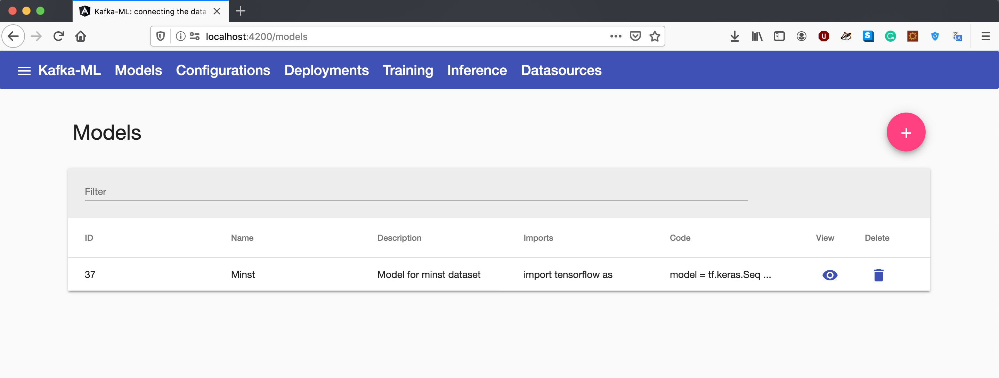

# Kafka-ML: connecting the data stream with ML/AI

Kafka-ML is a framework to manage the pipeline of Tensorflow/Keras machine learning (ML) models on Kubernetes. The pipeline involves the ML model design, training, and inference. The training and inference datasets for the ML models can be fed through Apache Kafka, thus they can be directly connected to data streams like the ones provided by the IoT. 

ML models can be easily defined in the Web UI with no need for external libraries and executions, providing an accessible tool for both machine learning experts and non-experts on ML/AI.


## For development

### Requirements

- [Python 3.6-3.8](https://www.python.org/)
- [Node.js](https://nodejs.org/)
- [Docker](https://www.docker.com/)
- [kubernetes>=v1.15.5](https://kubernetes.io/)

### Steps to build and execute the project locally

1. You may need to deploy a local register to upload your Docker images. You can deploy it in the port 5000:
    ```
    docker run -d -p 5000:5000 --restart=always --name registry registry:2
    ```

2. Build the backend and push the image into the local register:
    ```
    cd backend
    docker build --tag localhost:5000/backend .
    docker push localhost:5000/backend 
    ```

3. Build the model_training component and push the image into the local register:
    ```
    cd model_training
    docker build --tag localhost:5000/model_training .
    docker push localhost:5000/model_training 
    ```

4. Build the kafka_control_logger component and push the image into the local register:
    ```
    cd kafka_control_logger
    docker build --tag localhost:5000/kafka_control_logger .
    docker push localhost:5000/kafka_control_logger 
    ```

5. Build the model_inference component and push the image into the local register:
    ```
    cd model_inference
    docker build --tag localhost:5000/model_inference .
    docker push localhost:5000/model_inference 
    ```

6. Install the libraries and execute the frontend:
    ```
    cd frontend
    npm install
    ng build -c production
    docker build --tag localhost:5000/frontend .
    docker push localhost:5000/frontend 
    ```

7. Once built the images, you can deploy the system components in Kubernetes following this order:
    ```
    kubectl apply -f zookeeper-pod.yaml
    kubectl apply -f zookeeper-service.yaml
    
    kubectl apply -f kafka-pod.yaml
    kubectl apply -f kafka-service.yaml
    
    kubectl apply -f backend-deployment.yaml
    kubectl apply -f backend-service.yaml

    kubectl apply -f frontend-deployment.yaml
    kubectl apply -f frontend-service.yaml

    kubectl apply -f kafka-control-logger-deployment.yaml
    ```

8. Finally, you will be able to access the Kafka-ML Web UI: http://localhost/

## License
MIT